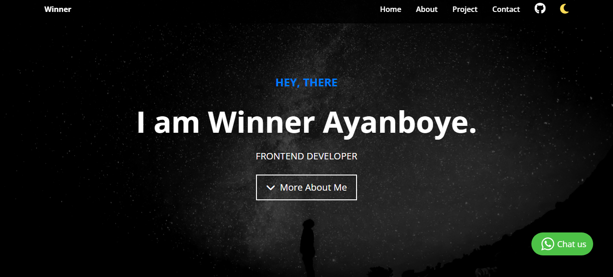

## Personal Portfolio Website

A responsive and interactive portfolio website built using HTML, CSS, and JavaScript to showcase my skills, projects, and personal information.

## Features

-Smooth Scroll Navigation: Navigation links scroll smoothly to different sections of the page.

-Light & Dark Mode: Toggle between light and dark modes for a customized viewing experience.

-Typing Text Animation: Dynamic typing effect on the home page that introduces my skills and background.

-Skills and Project Showcase: Sections to highlight my technical skills and display my recent projects.

## Technologies Used

-HTML: Provides the structure and content layout.

-CSS: Used for styling, animations, and creating a responsive design.

-JavaScript: Adds interactivity, such as scroll navigation, dark mode toggle, and typing text animations.

## Usage

-Scroll Navigation: Smooth scrolling allows easy navigation through different sections of the site.

-Light/Dark Mode Toggle: Switch themes by clicking the toggle button.

-Typing Effect: A dynamic typing text animation introduces my name on the home page.

